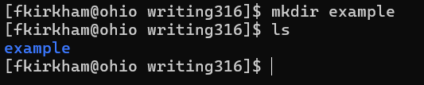
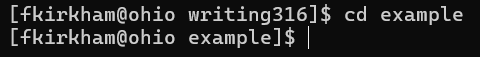
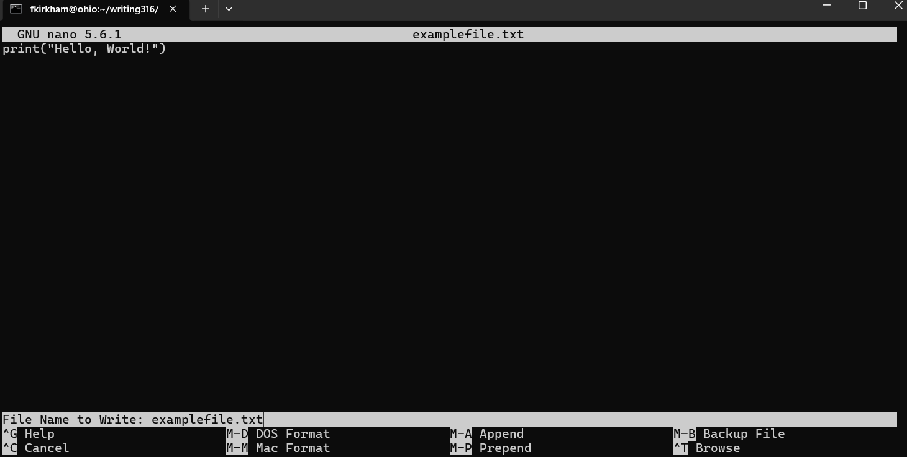
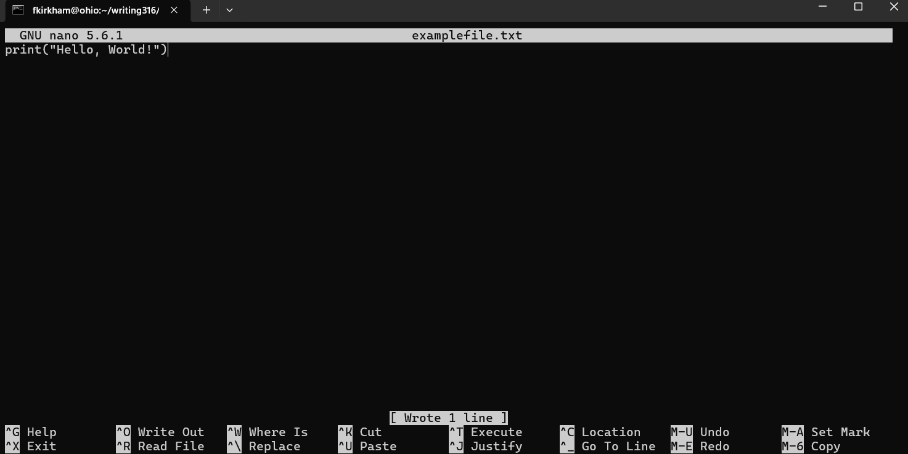
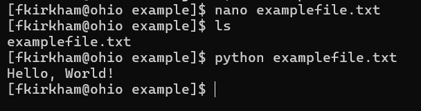
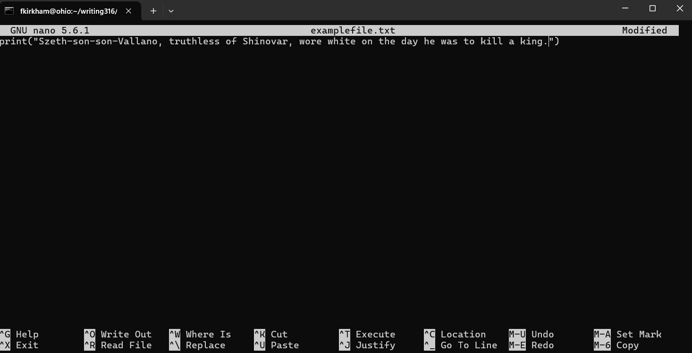
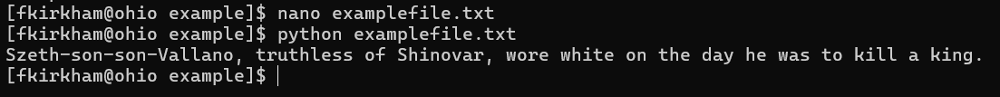
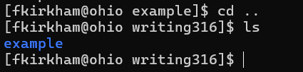
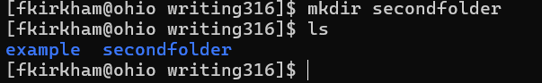
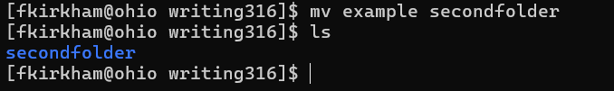

# How to use the Linux Terminal
This instruction guide will help you learn some command-line basics!

Knowing how to use the command line is a powerful skill. It provides you with fast, efficient file management that you can use in complicated tasks, like moving thousands of specific files at once from one folder to another. You can also log into another computer remotely, or install, run and edit software. And it works on almost any computer!

## Requirements
<body>
   
   A charged laptop with a Linux Terminal open<br/>
   See <i>Troubleshooting</i> for computers without Linux Terminal support
</body>

## Steps

### 1\. Make a folder
   1. Type ```mkdir name_of_your_folder``` then press ```enter```
   <details>
   <summary>Using ls to check directory contents</summary>
      
   Type ```ls``` then press ```enter``` <br>
   ```ls``` displays the files in your current directory. <br>
   You can use this command at any time to ensure files are created or moved correctly.
   </details>
   
   
   <br>
   <br>
### 2\. Move into folder
   1. Type ```cd name_of_your_folder``` then press ```enter``` <br>
   Your new directory is now displayed next to the username. <br>
   <details>
   <summary>Returning to the parent folder</summary>
      
   To return to the parent folder  type ```cd ..``` then press ```enter```
   </details>

   
   <br>
   <br>
### 3\. Create and Move Into a File
   1. Type ```nano filename.txt``` then press ```enter```<br><br>
   1. Type the following text: ```print("Hello, World!")``` <br>
   <details>
   <summary>Understanding the nano command</summary>
      
   ```nano``` creates a file and opens it automatically. If a file with that name has already been created, it opens the file.
   </details>

   
   <br>
   <br>
### 4\. Save and Exit
   1. Save with ```WriteOut``` by pressing ```ctrl + o``` (not zero.) <br>
      Terminal is now giving you the option to save it with the same file name      
      Press ```enter``` again to replace the file. <br><br>
   1. Exit by pressing ```ctrl + x```

       
   <br>
   <br>

### 5\. Run the Code
   1. Type the command ```python filename.txt``` and press enter <br>
   <details>
   <summary>Finding your filename</summary>
   
   If you are concerned whether your file saved or forgot the name, use the ```ls``` command from the first step. 
   </details>

   

   See <i>Troubleshooting</i> for help with error messages
   <br>
   <br>
   
### 6\. Editing the File to Create Your Own Message
   1. Type ```nano filename.txt``` then press ```enter```<br><br>
   2. Use the arrow keys to navigate into the end of the phrase “Hello World”.<br><br>
   3. Delete Hello World, and then type any message of your choice. <br><br>
   
   
   <br>
   <br>

### 7\. Save and Run New Message
   1. Repeat steps 4 and 5
   
      
   <br>
   <br>

### 8\. Moving Folders and Files
   1. Exit current folder with the ```cd ..``` command
      1. Use the  ```ls``` command to see the folder you have just exited
         
      

   1. Create new folder with the ```mkdir newfoldername``` command from step 1
      
      

   1. Move the old folder into the new one by typing ```mv /path/to/source_folder /path/to/destination/``` and pressing ```enter```<br>
      Since in this example both folders are in the same file, the path is just ```mv oldfoldername newfoldername```
      
      

   <details>
   <summary>Checking your work</summary>
      
   Remember, you can use ```cd name_of_your_folder```, ```cd ..```, and the ```ls``` command <br>
   to move in and out of folders, display folder contents, and ensure your folder was moved correctly.
   </details>


## Conclusion
You have now learned basic file manipulation in Linux! <br>
There is a lot to explore, and if you would like to learn more then you can try playing this game: [linuxsurvival.com](https://linuxsurvival.com/)

## Troubleshooting
#### Problem: No Linux Terminal on your computer
Solution: If you do not have a linux terminal on your computer, you can go to this website: [cylabacademy](https://learn.cylabacademy.org/) <br>
Log in with "writing316" as your username and password. <br>
Once you are logged in you can click the ```>_``` icon in the top right. <br>
You should now be able to practice with the terminal!
<br><br>
#### Problem: ```python``` keyword from step 5 isn't working
Solution: For certain machines, like a macbook pro, the ```python``` command is outdated. Try ```python3``` instead. <br>

<br><br>
#### Problem: Syntax or name error after using the command outlined in step 5
Solution: If you get a syntax error or name error after using the command ```python3 name_of_your_file.txt```, <br>
make sure you typed out the sentence exactly as shown in step 3. You may not have typed ```print``` correctly or <br>
forgot symbols like these: ```()""```
<br><br>
## Caution
Do not use spaces, -, or * for file names or when using the command ```rm``` to remove your file.

## Survey
How did we do?
[](https://forms.gle/Uyh9GfeSEtA6TSXHA)  
https://forms.gle/Uyh9GfeSEtA6TSXHA
